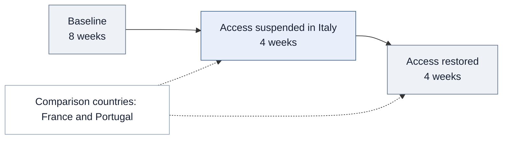

<div align="center">

# Measuring the Impact of the Launch of a Generative AI Product (ChatGPT)

A causal inference case study connecting large-scale behavioral data to product measurement.

### Developer productivity, collaboration, and skill adoption


**Product analytics · Quasi-experimentation · Data engineering · User segmentation**

[Results](#results-at-a-glance) · [Product implications](#from-evidence-to-product-decisions) · [Methods](#how-i-designed-the-analysis) · [Code](#explore-the-implementation)

</div>

## The decision behind the analysis

**How should a team evaluate an AI tool when its value extends beyond the volume of work users produce?**

For a developer product, more commits can be a useful signal—but they do not capture whether users help others or adopt unfamiliar technologies. I designed a measurement framework spanning **production, collaboration, and learning**, then used an external interruption in ChatGPT availability to estimate how each dimension responded.

This study uses GitHub developer activity around Italy's temporary ChatGPT suspension. It offers a product analytics approach to a common problem: measuring impact when users self-select into a tool and a randomized experiment is unavailable.

## Results at a glance

<table>
<tr>
<th align="left">Code development</th>
<th align="left">Skill adoption</th>
<th align="left">Knowledge sharing</th>
</tr>
<tr>
<td valign="top"><h2>−6.4%</h2>During the suspension<br><sub>Repository creation, commits, and pull requests</sub></td>
<td valign="top"><h2>−8.4%</h2>During the suspension<br><sub>First observed use of new programming languages</sub></td>
<td valign="top"><h2>+9.6%</h2>After access resumed<br><sub>Reviews, issues, and discussion participation</sub></td>
</tr>
</table>

These are relative effects reported in the underlying study's matched difference-in-differences analysis. The restoration estimate uses the pre-suspension baseline; the three estimates describe different outcomes and periods, not a single combined productivity lift.

**The product insight:** AI's observed value spans individual output and behaviors that support a developer ecosystem. An evaluation focused on code production alone would miss part of that value.

## From evidence to product decisions

The following are applications of the findings to product measurement, rather than claims that these product interventions were tested.

| Product question | What the evidence suggests | How I would apply it |
|---|---|---|
| **What belongs in the success metric framework?** | Output, collaboration, and technology adoption respond differently. | Evaluate a portfolio of outcomes alongside quality guardrails, rather than relying on one activity count. |
| **Which users benefit?** | Benefits vary with developer experience and technological context. | Report effects by meaningful user segments before treating an average effect as universal. |
| **Does a short evaluation capture the full response?** | Knowledge sharing increased in the post-restoration period. | Examine behavior over time and distinguish immediate responses from later changes. |
| **Can these estimates justify a rollout or ROI forecast?** | The study identifies effects in a specific access-interruption setting. | Use the findings to shape hypotheses and a subsequent product experiment; measure costs, retention, and quality directly before making an ROI claim. |

## My role and scope

I led **problem formulation, KPI definition, data collection, feature engineering, modeling, causal analysis, validation, and interpretation** within collaborative doctoral research at UC Irvine.

The work required both analytical judgment and substantial data engineering. Across the broader research program, I built an automated Python pipeline that screened approximately **127 million users and 320 million repositories**, producing a resource of approximately **680,000 developers, 2 million repositories, and 13.6 million user-week observations**. Multithreaded collection and error handling for HPC execution reduced collection time from approximately **five months to under three weeks**, with validated records persisted in **PostgreSQL and MongoDB**.

Those figures describe the shared infrastructure. This study's activity dataset contains **88,022 developers**; its language-history dataset spans **1,989,535 repositories across 87,536 developers**. Matching and model eligibility further determine the estimation samples.

## How I designed the analysis

### 1. Translate the question into observable behavior

| Dimension | Operational definition | Interpretation boundary |
|---|---|---|
| Production | Weekly repository creations, commits, and pull requests | Activity volume, not direct code quality or business value |
| Collaboration | Weekly reviews, issue reports, and discussion participation | Observable knowledge-sharing activity, not its usefulness to recipients |
| Learning | First observed language use across a developer's repository history | Technology adoption as a skill-acquisition proxy, not a proficiency test |

Historical language coverage matters: looking only inside the experiment window could misclassify a previously used language as newly acquired. Consistent user-week construction also matters because incomplete collection should not be mistaken for inactivity.

### 2. Use an external change in access

Italy's temporary ChatGPT suspension created a natural experiment. I compared changes among developers in **Italy** with changes among developers in **France and Portugal**, using propensity-score matching on pre-treatment characteristics to improve observed comparability.



**Observation window:** February 4–May 26, 2023. The design estimates the effect of a change in country-level availability; it does not observe individual ChatGPT usage.

### 3. Estimate effects with a panel model

I used **difference-in-differences with two-way fixed effects and Poisson estimation** for nonnegative, skewed activity outcomes. Developer effects account for stable individual differences; week effects account for common time shocks. Working-day controls address calendar differences, and developer-clustered standard errors account for repeated observations from the same person.

<details>
<summary><strong>Technical detail · Model specification and effect interpretation</strong></summary>

For developer <em>i</em> in week <em>t</em>, the conditional mean is specified as:

```text
E[Y_it | X] = exp(
    developer_effect_i + week_effect_t
    + beta_ban × Italy_i × Ban_t
    + beta_restore × Italy_i × Restored_t
    + controls_it
)
```

The pre-suspension period is the reference. Each treatment coefficient is interpreted as a proportional change through `100 × (exp(beta) − 1)`. The restoration coefficient is a comparison with the pre-suspension baseline, not a direct estimate of the change from the suspension period.

The skill-acquisition analysis additionally accounts for repository characteristics. The public [model contract](causal_design.py) summarizes the specification; [methodology notes](methodology.md) explain its scope.

</details>

### 4. Check the design and investigate variation

I examined pre-treatment patterns with lead-lag estimates and investigated GitHub Copilot language coverage as a competing explanation. Matching addresses observed composition; it does not eliminate unobserved differential shocks, and an insignificant pre-trend test does not prove parallel counterfactual trends.

To understand heterogeneous effects, I used structural-feature **K-Means segmentation** and **skip-gram language embeddings with hierarchical clustering** of language co-occurrence across approximately 2 million repositories, deriving seven user-technology segments. This connects differences in outcomes to users' experience and technology context rather than treating the population as homogeneous.

The findings suggest that less experienced developers primarily benefited in code development, while knowledge sharing and skill acquisition revealed additional benefits among more experienced developers. These differences motivate segment-specific hypotheses for future product experiments.

## What this study adds

The contribution is the connection between **metric design, causal identification, and user heterogeneity**. Instead of stopping at an average change in activity, the analysis asks which behaviors moved, for whom, and under what technological conditions.

For product work, that supports a more precise measurement strategy. It does not directly establish effects on revenue, retention, code correctness, or long-term proficiency. Those outcomes would require their own instrumentation and evaluation.

## Explore the implementation

> **Research status and code availability:** The research is currently under review. The full research code and data are proprietary and are not distributed here. The public code consists only of selected, simplified samples of the general workflow; it is not the complete research implementation or a replication package.

| Start here | What to inspect |
|---|---|
| [Collection workflow](collection.py) | Paginated acquisition, bounded retries, and persistence before checkpoint advancement |
| [Behavioral features](panel_features.py) | Weekly outcome construction and chronological first-use language detection |
| [Technology segments](technology_segments.py) | Representative skip-gram embeddings and hierarchical language grouping |
| [Causal design](causal_design.py) | Outcomes, treatment terms, fixed effects, and clustering made explicit |
| [Methodology](methodology.md) | Measurement choices, identification assumptions, and scope of inference |

<details>
<summary><strong>About the public samples and research source</strong></summary>

The Python files are selected, refactored illustrations, including representative reconstructions where proprietary implementations are not distributed. They are intended for code review and do not reproduce the study estimates. Confidential datasets, credentials, and original production code are excluded. See [code provenance and scope](code-notes.md).

**Underlying study:** <em>Beyond Code: The Multidimensional Impacts of Large Language Models in Software Development.</em> This portfolio describes my contributions to collaborative doctoral research; the manuscript title does not imply a particular publication status.

</details>

---

**Sardar Fatooreh Bonabi** · Data Science · University of California, Irvine  
[GitHub](https://github.com/SardarBonabi/) · [LinkedIn](https://www.linkedin.com/in/sardarb/)
