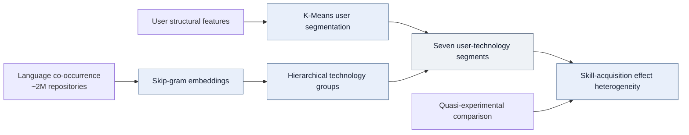
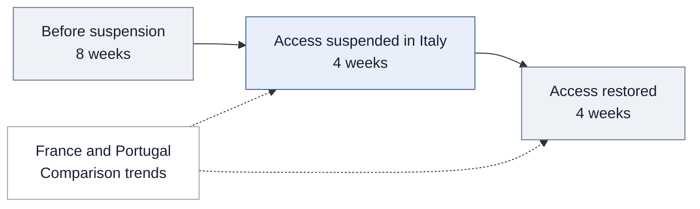

<div align="center">

# How Does an AI Product Impact User Behavior and Outcome?
# How Does this Impact Vary Across User Segments?

Combining a quasi-experiment with machine-learned user segments to estimate how an AI product changes user behavior and outcomes, and what are its heterogenous impacts across user groups.

**Causal inference · Quasi-experimentation · Machine learning · K-Means · Skip-gram embeddings · Hierarchical clustering**

[Overview](#project-overview) · [ML](#machine-learning-for-user-segmentation) · [Design](#quasi-experimental-design) · [Impact](#impact-on-user-behavior-and-outcomes) · [Segments](#how-impact-varies-across-user-segments) · [Code](#explore-the-implementation)

</div>

## Project overview

**I combined quasi-experimental causal inference with unsupervised machine learning to estimate how an AI product changes user behavior and outcomes, and how those effects vary across user segments.**

Italy's temporary suspension of ChatGPT in 2023 created an external change in product access. I compared developer activity in Italy with activity in France and Portugal before, during, and after the suspension. This allowed me to estimate the impact of changed access while accounting for stable differences between developers and common changes over time.

The analysis answers two connected questions:

1. **Product impact:** How does access affect code development, knowledge sharing, and skill acquisition?
2. **Segment differences:** How does that impact vary with developer experience and technology context, including **seven user-technology segments derived using machine learning**?

For a product team, the result is evidence about **what the product changes and for whom**. The work connects **causal impact estimation** with **ML-based segmentation**: the quasi-experiment estimates the response to changed access, while learned technology groups structure the analysis of variation across users.

## Machine learning for user segmentation

**I trained K-Means on structural features and used skip-gram embeddings with hierarchical clustering of programming-language co-occurrence across approximately 2 million repositories. This work produced seven user-technology segments, across which I estimated skill-acquisition effects.**

<table>
<tr><th align="left">Representation learning</th><th align="left">Unsupervised clustering</th><th align="left">Effect heterogeneity</th></tr>
<tr><td valign="top"><h2>~2M repositories</h2>Programming-language co-occurrence<br><sub>Skip-gram embeddings</sub></td><td valign="top"><h2>7 segments</h2>Empirical user-technology categories<br><sub>K-Means and hierarchical clustering</sub></td><td valign="top"><h2>Segment-level effects</h2>Skill-acquisition responses<br><sub>Connected to the quasi-experiment</sub></td></tr>
</table>

### **K-Means: segment users using structural features**

**I trained K-Means on structural features to segment users.** This provides a data-driven description of differences between developers, complementing the analysis by experience. The confidential feature definitions and fitted model are not distributed in this showcase.

### **Skip-gram embeddings: learn technology relationships**

**I trained skip-gram embeddings on programming-language co-occurrence across approximately 2 million repositories.** The embeddings represent languages through their observed co-occurrence patterns, providing a learned representation of technology context rather than relying solely on manually specified language categories.

### **Hierarchical clustering: derive empirical technology groups**

**I applied hierarchical clustering to the language representations to derive empirical technology groups.** Together with the user-segmentation work, this resulted in **seven user-technology segments**. I then estimated skill-acquisition effects across these data-driven categories to investigate how the response to AI access differed by technology context.



The diagram summarizes the analytical components, not the proprietary assignment algorithm. **The ML models describe users and technology context; the quasi-experimental design identifies the access-related effects.** Clustering alone does not establish causality.

<details>
<summary><strong>ML implementation scope</strong></summary>

The [technology-segmentation sample](technology_segments.py) illustrates the embedding and hierarchical-clustering component. It does not reproduce the full K-Means user model, original training settings, or rules assigning users to the seven segments. The completed work is described from the supplied resume; sample settings are representative rather than recovered research parameters.

</details>

## Quasi-experimental design

### Use an external change in product access

| Design element | Implementation |
|---|---|
| Product | ChatGPT |
| External event | Temporary access suspension in Italy |
| Treatment group | Developers in Italy |
| Comparison group | Developers in France and Portugal |
| Observation window | February 4–May 26, 2023: 8 weeks before, 4 weeks during, and 4 weeks after the suspension |
| Panel | Repeated developer-week observations |
| Estimation | Pre-treatment matching and Poisson difference-in-differences |



This was an externally occurring quasi-experiment, not a randomized rollout. The treatment is a change in **country-level product availability**; individual ChatGPT use is not directly observed.

### Estimate changes relative to a comparison group

I matched developers on pre-treatment characteristics to improve observed comparability. I then used **Poisson difference-in-differences with developer and week fixed effects**, working-day controls, and developer-clustered standard errors.

The model compares changes in the treated group with contemporaneous changes in the comparison group. Developer effects account for stable individual differences; week effects account for common time shocks. Poisson estimation accommodates nonnegative, skewed activity outcomes, and clustering accounts for repeated observations from the same developer.

<details>
<summary><strong>Model specification and effect interpretation</strong></summary>

```text
E[Y_it | X] = exp(developer_effect_i + week_effect_t
                 + beta_ban × Italy_i × Ban_t
                 + beta_restore × Italy_i × Restored_t
                 + controls_it)
```

The pre-suspension period is the reference. Proportional effects are `100 × (exp(beta) − 1)`. The language-adoption model additionally accounts for repository characteristics. See the [model contract](causal_design.py).

</details>

## Impact on user behavior and outcomes

I estimated effects on three dimensions of developer behavior:

| Outcome | Weekly operational measure | What the measure captures |
|---|---|---|
| Code development | Repository creations, commits, and pull requests | Production activity |
| Knowledge sharing | Reviews, issue reports, and discussions | Collaborative contribution |
| Skill acquisition | First observed programming-language use in repository history | Adoption of a previously unobserved technology |

Historical language coverage helps distinguish new adoption from previous use. Consistent developer-week construction also prevents incomplete collection from being interpreted as inactivity. These outcomes measure observable behavior: they are not direct assessments of code correctness, contribution usefulness, or proficiency.

### Estimated effects

<table>
<tr><th align="left">Output</th><th align="left">Technology adoption</th><th align="left">Collaboration</th></tr>
<tr>
<td valign="top"><h2>−6.4%</h2>During lost access<br><sub>Repository creation, commits, and pull requests</sub></td>
<td valign="top"><h2>−8.4%</h2>During lost access<br><sub>First observed use of new programming languages</sub></td>
<td valign="top"><h2>+9.6%</h2>After access resumed<br><sub>Reviews, issues, and discussions</sub></td>
</tr>
</table>

These are adjusted relative effects from matched difference-in-differences. The post-restoration estimate is relative to the **pre-suspension baseline**, not the suspension period. They measure different outcomes and cannot be added into one productivity lift.

The findings show that the response to product access extends across production, collaboration, and technology adoption. The timing also matters: the code-development and skill-acquisition estimates describe the suspension, while the knowledge-sharing estimate describes the period after access resumed.

## How impact varies across user segments

**The second part of the analysis asks whether the same product affects different users in different ways.** I examined differences by developer experience and technology context rather than treating the overall effect as representative of every user.

| Segment dimension | Finding or analytical role |
|---|---|
| Developer experience | Less experienced developers primarily benefited in code development; knowledge sharing and skill acquisition revealed additional benefits among more experienced developers |
| Technology context | User-technology segmentation provided a way to investigate variation across the technologies developers work with |

I estimated **skill-acquisition effects across the seven ML-derived user-technology segments**, connecting the learned categories to the quasi-experiment. The experience analysis and technology-segment analysis address complementary dimensions of heterogeneity.

Segmentation organizes the heterogeneity analysis; clustering alone does not establish a causal effect. The experience findings describe differences in the dimensions of benefit, not a claim that one group benefits more on every outcome. Segment-specific effect sizes are not reproduced in the public samples.

## Assessing the causal interpretation

I examined pre-treatment patterns with lead-lag estimates and investigated GitHub Copilot language coverage as a competing explanation.

| Check or assumption | Why it matters |
|---|---|
| Pre-treatment matching | Improves comparability on observed characteristics before access changed |
| Pre-treatment trends | Assesses whether the groups showed different patterns before the suspension |
| Developer and week fixed effects | Accounts for stable user differences and common time shocks |
| Developer-clustered inference | Accounts for dependence across repeated observations |
| Alternative technology access | Helps assess competing explanations for the observed response |

The causal interpretation depends on the comparison group representing the treated group's counterfactual trend. Matching cannot remove unobserved differential shocks, and an insignificant pre-trend test does not prove that assumption. The results apply to this access interruption and population; effects of a new launch or another AI product would require their own evaluation.

## What the analysis tells a product team

The analysis provides an estimate of **which behaviors respond to product access, the direction and magnitude of those responses, and how benefits differ across users**. It supports a more specific account of product impact than a single population-average activity change.

The segment findings can inform hypotheses about who benefits and in what way. They do not establish a tested targeting policy. Revenue, retention, and ROI were outside this analysis; the measured outcomes are developer production, collaboration, and technology adoption.

## My contribution and data scope

I led problem definition, data collection, outcome construction, **feature engineering, K-Means segmentation, skip-gram representation learning, hierarchical clustering**, causal modeling, validation, and interpretation within collaborative doctoral research at UC Irvine.

This analysis uses an activity dataset of **88,022 developers** and a language-history dataset spanning **1,989,535 repositories across 87,536 developers**. Matching and eligibility further determine the estimation samples.

<details>
<summary><strong>Data engineering supporting the analysis</strong></summary>

Across the shared research program, my automated Python pipeline screened approximately **127 million users and 320 million repositories** and produced a resource covering **680,000 developers, 2 million repositories, and 13.6 million user-weeks**. These are broader infrastructure totals, not this study's estimation sample.

Multithreaded collection and error handling for HPC execution reduced collection time from approximately **five months to under three weeks**, with records persisted in **PostgreSQL and MongoDB**.

</details>

## Explore the implementation

> **Research status and code availability:** The research is currently under review. The full research code and data are proprietary and are not distributed here. The public code consists only of selected, simplified samples of the general workflow; it is not the complete research implementation or a replication package.

| Sample | What to inspect |
|---|---|
| [Collection workflow](collection.py) | Pagination, bounded retries, persistence, and checkpoints |
| [Behavioral features](panel_features.py) | Weekly outcomes and chronological language adoption |
| **[ML: technology segmentation](technology_segments.py)** | **Skip-gram embeddings and hierarchical clustering**; representative component of the seven-segment analysis |
| [Causal design](causal_design.py) | Treatment terms, fixed effects, and inference |
| [Methodology](methodology.md) | Measurement choices and identification assumptions |

<details>
<summary><strong>Research source and sample scope</strong></summary>

This case study presents my contributions to collaborative doctoral research at UC Irvine, focused on estimating product impact and differences across user segments. The underlying study is *Beyond Code: The Multidimensional Impacts of Large Language Models in Software Development*.

Public files include selected refactored examples and representative reconstructions. They do not reproduce the research estimates. See [code provenance and scope](code-notes.md).

</details>

---

**Sardar Fatooreh Bonabi** · Data Science · University of California, Irvine  
[GitHub](https://github.com/SardarBonabi/) · [LinkedIn](https://www.linkedin.com/in/sardarb/)
