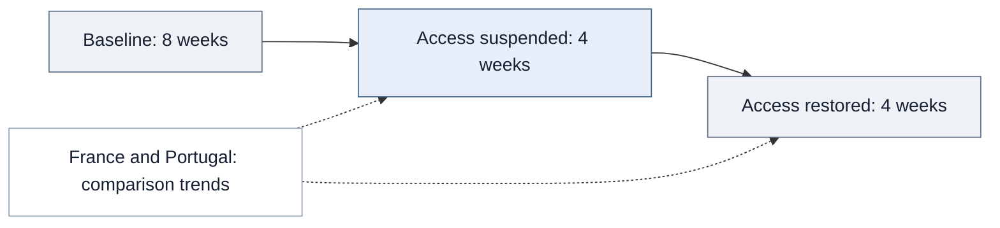

<div align="center">

# How Does an AI Product Impact User Behavior and Outcome? 
# How Does this Impact Vary Across User Segments?

Measuring output, collaboration, and technology adoption to evaluate product value.

**Product measurement · Causal inference · User segmentation · Data engineering**

[Decision](#the-product-decision) · [Results](#results-and-interpretation) · [Approach](#analytical-approach) · [Code](#explore-the-implementation)

</div>

## The product decision

**What should count as success when evaluating an AI developer tool—and which users benefit?**

A product team needs to know whether a tool helps users accomplish more, contribute to a shared ecosystem, and expand what they can do. A single activity metric can miss these different forms of value. Comparing tool adopters with non-adopters also risks confusing product impact with pre-existing differences between users.

I built a measurement framework across three behaviors and used an external interruption in ChatGPT availability to estimate their response. The analysis uses GitHub activity around Italy's 2023 suspension, with France and Portugal as comparison countries. It provides evidence for designing a product evaluation when random assignment is unavailable.

## Results and interpretation

<table>
<tr><th align="left">Output</th><th align="left">Technology adoption</th><th align="left">Collaboration</th></tr>
<tr>
<td valign="top"><h2>−6.4%</h2>During lost access<br><sub>Repository creation, commits, and pull requests</sub></td>
<td valign="top"><h2>−8.4%</h2>During lost access<br><sub>First observed use of new programming languages</sub></td>
<td valign="top"><h2>+9.6%</h2>After access resumed<br><sub>Reviews, issues, and discussions</sub></td>
</tr>
</table>

These are adjusted relative effects from matched difference-in-differences. The post-restoration estimate is relative to the **pre-suspension baseline**, not the suspension period. They measure different outcomes and cannot be added into one productivity lift.

**Decision relevance:** evaluate value across output, collaboration, and adoption of unfamiliar technologies. The evidence also suggests different benefits by experience: less experienced developers primarily benefited in code development, while collaboration and skill acquisition revealed additional benefits among more experienced developers.

## How this would inform a product evaluation

| Decision | Application of the evidence | Additional evidence needed |
|---|---|---|
| Define launch success | Track several dimensions of user success, with quality guardrails alongside activity | Direct quality measures and the product's intended user outcomes |
| Choose target segments | Estimate effects by experience and technology context | Segment-level results for the product and population being considered |
| Set the evaluation window | Separate immediate changes from later collaboration responses | Longer follow-up to assess persistence |
| Assess investment | Use the findings to motivate a product experiment | Retention, costs, and commercial outcomes before estimating ROI |

These are proposed product applications. The analysis did not test a commercial rollout, retention strategy, or revenue impact.

## Analytical approach

### 1. Define a metric system around user outcomes

| Metric family | Weekly measurement | Interpretation |
|---|---|---|
| Output | Repository creations, commits, and pull requests | Observable activity; not a direct measure of useful or correct code |
| Collaboration | Reviews, issue reports, and discussions | Participation in knowledge sharing; not its value to recipients |
| Technology adoption | First observed programming-language use in repository history | An adoption proxy for skill acquisition; not a proficiency assessment |

Historical coverage prevents previously used languages from being mislabeled as new. Consistent developer-week construction prevents incomplete collection from being interpreted as inactivity.

### 2. Estimate impact without relying on self-selected adoption

I matched developers using pre-treatment characteristics and compared changes in Italy with changes in France and Portugal.



The February 4–May 26, 2023 window supports an analysis of **country-level availability**, rather than individual ChatGPT usage, which is not directly observed.

I used **Poisson difference-in-differences with developer and week fixed effects**, working-day controls, and developer-clustered standard errors. This accommodates nonnegative, skewed activity outcomes while accounting for stable user differences, common time shocks, and repeated observations.

<details>
<summary><strong>Model specification and effect interpretation</strong></summary>

```text
E[Y_it | X] = exp(developer_effect_i + week_effect_t
                 + beta_ban × Italy_i × Ban_t
                 + beta_restore × Italy_i × Restored_t
                 + controls_it)
```

The pre-suspension period is the reference. Proportional effects are `100 × (exp(beta) − 1)`. The language-adoption model additionally accounts for repository characteristics. See the [model contract](causal_design.py).

</details>

### 3. Check credibility and explain variation

I examined pre-treatment patterns using lead-lag estimates and investigated GitHub Copilot language coverage as a competing explanation. Matching improves observed comparability; unobserved differential shocks remain a threat. An insignificant pre-trend test does not establish parallel counterfactual trends.

To investigate variation, I combined **K-Means on structural features** with **skip-gram language embeddings and hierarchical clustering** across approximately 2 million repositories, deriving seven user-technology segments. Segmentation connects average effects to differences in experience and technology context.

## What I owned and delivered

I led problem definition, KPI design, collection, feature engineering, modeling, validation, and interpretation. Across the shared research program, my automated Python pipeline screened approximately **127 million users and 320 million repositories** and produced a resource covering **680,000 developers, 2 million repositories, and 13.6 million user-weeks**. Multithreaded collection and error handling for HPC execution reduced collection time from approximately **five months to under three weeks**, with records persisted in **PostgreSQL and MongoDB**.

This analysis uses an activity dataset of **88,022 developers** and a language-history dataset spanning **1,989,535 repositories across 87,536 developers**. Matching and eligibility further determine model samples; the broader infrastructure totals are not the study sample size.

The deliverable is a framework connecting **user-success metrics, causal estimation, and segmentation**. Its findings inform hypotheses for product testing; they do not establish revenue, retention, correctness, or long-term proficiency effects.

## Explore the implementation

> **Research status and code availability:** The research is currently under review. The full research code and data are proprietary and are not distributed here. The public code consists only of selected, simplified samples of the general workflow; it is not the complete research implementation or a replication package.

| Sample | What to inspect |
|---|---|
| [Collection workflow](collection.py) | Pagination, bounded retries, persistence, and checkpoints |
| [Behavioral features](panel_features.py) | Weekly outcomes and chronological language adoption |
| [Technology segments](technology_segments.py) | Representative embeddings and hierarchical grouping |
| [Causal design](causal_design.py) | Treatment terms, fixed effects, and inference |
| [Methodology](methodology.md) | Measurement choices and identification assumptions |

<details>
<summary><strong>Research source and sample scope</strong></summary>

This case study presents my contributions to collaborative doctoral research at UC Irvine, framed around the product decisions the analysis can inform. The underlying study is *Beyond Code: The Multidimensional Impacts of Large Language Models in Software Development*. Product applications described here are proposed uses of the evidence, not claims of a commercial deployment or a tested product rollout.

Public files include selected refactored examples and representative reconstructions. They do not reproduce the research estimates. See [code provenance and scope](code-notes.md).

</details>

---

**Sardar Fatooreh Bonabi** · Data Science · University of California, Irvine  
[GitHub](https://github.com/SardarBonabi/) · [LinkedIn](https://www.linkedin.com/in/sardarb/)
