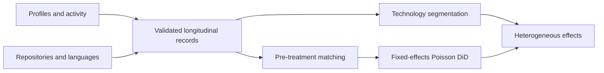

# How Generative AI Changes Developer Productivity

**Causal inference · Large-scale data engineering · Feature engineering · Unsupervised learning**

I studied how access to ChatGPT changes what software developers build, share, and learn. Using a natural experiment and longitudinal GitHub data, I connected a large-scale collection pipeline to causal estimates of developer behavior—and showed why counting code alone misses part of AI's impact.

| Selected finding | Interpretation |
|---|---|
| **6.4% less code development** | During the temporary suspension of ChatGPT in Italy |
| **8.4% less skill acquisition** | During the suspension, measured through first observed programming-language use |
| **9.6% more knowledge sharing** | After access resumed, relative to the pre-suspension baseline in the study's DiD specification |

## The problem

Organizations evaluating AI tools need to understand more than output volume. A tool can also change knowledge exchange, entry into unfamiliar technologies, and the distribution of benefits across experience levels. I translated that broad question into three measurable outcomes and a research design that uses an external change in access to ChatGPT.

## My contribution

I led problem formulation, KPI definition, data collection, feature engineering, modeling, causal analysis, validation, and interpretation. Across the research program, I built an automated Python pipeline that screened approximately **127 million GitHub users and 320 million repositories**, producing an analytical resource of approximately **680,000 developers, 2 million repositories, and 13.6 million user-week observations**.

I engineered REST API clients, multithreaded collection, and error handling for HPC execution, reducing collection time from approximately **five months to under three weeks**. Validated records were persisted in **PostgreSQL and MongoDB**. These are shared research-program totals, not the matched sample size of this individual study.

## How I approached it

1. **Build the research population.** Collect developer profiles, activity, repository metadata, and language histories; identify treatment and comparison countries; organize repeated observations into consistent records.
2. **Engineer meaningful outcomes.** Aggregate repository creation, commits, and pull requests into code development; use reviews, issues, and discussions to measure knowledge sharing; track first observed language use over repository histories as a skill-acquisition proxy.
3. **Construct the comparison.** Use Italy's temporary ChatGPT suspension as the treatment, with France and Portugal as controls. Match developers on pre-treatment characteristics using propensity scores.
4. **Estimate changes over time.** Apply difference-in-differences with developer and week fixed effects using Poisson estimation for count outcomes. Account for working days and cluster standard errors by developer.
5. **Examine identification and robustness.** Assess pre-treatment patterns with lead-lag estimates, examine experience groups, and investigate GitHub Copilot language coverage as a competing explanation.
6. **Understand who benefits.** Use structural-feature K-Means segmentation and skip-gram embeddings with hierarchical clustering of language co-occurrence across approximately 2 million repositories to derive seven user-technology segments and analyze heterogeneous skill-acquisition effects.

## Findings and why they matter

The suspension reduced both code development and first observed use of new languages. Resumed access increased knowledge sharing. The benefits differed by experience and technological context: less experienced developers primarily benefited in code development, while knowledge sharing and skill acquisition revealed additional benefits among more experienced developers.

The contribution is a broader measurement framework for AI-assisted work: **production, collaboration, and learning**. For a Data Scientist, the transferable challenge is connecting raw behavioral traces to defensible metrics and then distinguishing changes associated with a treatment from simple correlations.

## Research design at a glance

| Element | Study design |
|---|---|
| Activity window | February 4–May 26, 2023: 8 pre-suspension, 4 suspension, 4 post-restoration weeks |
| Activity dataset | 88,022 users before subsequent estimation restrictions |
| Language dataset | 1,989,535 repositories across 87,536 users |
| Identification | Matched difference-in-differences; Italy versus France and Portugal |
| Estimation | Poisson model with developer and week fixed effects; developer-clustered standard errors |
| Outcomes | Code development, knowledge sharing, first observed language use |

Country-level availability does not establish each individual's actual AI use. Causal interpretation depends on comparable untreated trends and the absence of differential concurrent shocks. Language adoption measures observed behavior, not tested proficiency. These distinctions guided how I interpreted the findings.

## Explore the work

| Sample | What it demonstrates |
|---|---|
| [Collection workflow](collection.py) | Pagination, bounded retries, dependency injection, and checkpoint ordering |
| [Panel features](panel_features.py) | Consolidating activity and first-use language logic into readable transformations |
| [Technology segmentation](technology_segments.py) | Representative skip-gram and hierarchical-clustering workflow |
| [Causal specification](causal_design.py) | Explicit outcomes, treatment terms, and model contract |
| [Methodology](methodology.md) | Measurement, identification, segmentation, and interpretation |

**Underlying study:** *Beyond Code: The Multidimensional Impacts of Large Language Models in Software Development.*

## About the code

This is a curated research showcase. The Python files are condensed, refactored examples of selected workflows, with representative reconstructions where the full proprietary implementation is not included. They are designed for code review, not as a runnable replication package. Research results below describe the completed studies; the samples do not reproduce those estimates.

The confidential dataset, original collection archive, credentials, and proprietary production code are not distributed. See [sample provenance and scope](code-notes.md).

## Research and contact

**Sardar Fatooreh Bonabi** · Data Science · University of California, Irvine  
[GitHub](https://github.com/SardarBonabi/) · [LinkedIn](https://www.linkedin.com/in/sardarb/)

This portfolio presents my contributions to collaborative doctoral research. Manuscript titles identify the underlying studies; no journal acceptance or publication status is implied.
