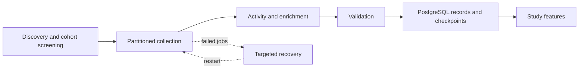

# Data collection: from discovery to analysis-ready records

> **Research status and code availability:** The research is under review. Full research code and data are proprietary. These files show selected, refactored samples of the general workflow, not the complete implementation or a replication package.

The collection pipeline supports **developer productivity, collaboration, and technology adoption**. It separates acquisition, validation, recovery, and database persistence so the analytical results are built on identifiable collection stages.

**Workflow:** discovery → profiles → weekly activity → repositories → languages → validated PostgreSQL records → analytical features.

Repository discovery supplies owner candidates; profile screening establishes the cohort; weekly collection measures behavior; repository inventories and language enrichment provide the history needed to distinguish first observed language use from prior activity.

## Follow the code

| Layer | What the sample demonstrates |
|---|---|
| [Study orchestration](collection.py) | Ordered stages, study-specific dependencies, and a gate that stops downstream work when collection is incomplete |
| [Data contracts](collection_contracts.py) | Versioned jobs, explicit page completion, opaque identifiers, and private source/storage interfaces |
| [Concurrent execution](collection_runtime.py) | Bounded multithreading, worker-owned resources, retry/backoff, pagination checks, and resumable partitions |
| [Selected extraction logic](collection_extracts.py) | Weekly category counts, language expansion, event-reference deduplication, and pull-request structural details |
| [Validation and transformation](collection_transforms.py) | Required fields, nonnegative counts, date parsing, duplicate detection, and allowlisted records |
| [PostgreSQL persistence](collection_storage.py) | Parameterized writes, idempotent upserts, checkpoint locking, and atomic page commits |
| [Illustrative staging schema](collection-schema.sql) | Keys and constraints supporting records, snapshots, partitions, and restart positions |

## Collection stages and record grain

| Stage | Input and transformation | Persisted grain |
|---|---|---|
| Discovery | Paginated repository inventory identifies repositories and owner candidates | Repository-owner relationship |
| Profiles | Profile enrichment, stable identity resolution, and private cohort screening | Developer within a versioned cohort snapshot |
| Weekly activity | Fixed observation windows; seven public activity categories plus aggregate private activity where available | Developer-week |
| Repositories | Paginated repository enrichment, creation dates, fork status, and context | Developer-repository snapshot |
| Languages | Repository language composition enriched separately from the repository inventory | Repository-language-observation date |
| Participation | Deduplicated repository references from observed activity | Developer-project-week-activity type |
| Pull requests | Detail enrichment of deduplicated pull references | Pull-request-observation date |

The study's `STAGES` sequence selects the relevant branches. Private manifests derive each stage's inputs from committed upstream records. Repository inventories and activity-linked repositories serve different purposes; neither is silently substituted for the other.

## Reliability and parallelism

**One reusable worker replaces repeated country/partition scripts.** The scheduler keeps at most one pending future per worker slot. Each job opens its own source client and database connection; a private, shared rate-budget policy coordinates workers using the same authorized identity. Increasing workers does not increase the permitted request rate.

**Fetch → parse → validate → commit records and cursor together.** A successful HTTP response is not enough to certify a complete observation. The source adapter must validate page completeness and pagination before emitting a page. An empty page is not automatically the end; completion is explicit. Missing weekly counts are rejected rather than filled with zero.

**Recovery is partition-based.** Checkpoints distinguish an unstarted job from a completed one, even though both may have a null cursor. Records and checkpoint revisions commit in one PostgreSQL transaction. A stale worker cannot overwrite a newer checkpoint. Failed pages leave the last committed position intact; completed partitions can be skipped on a repeat run. The mechanism supports replay-safe storage, not exactly-once network requests.

**Errors have different responses.** Transient failures use bounded retries with jitter. Server-directed waits are respected; waits beyond the inline budget defer the job. Authentication, permissions, malformed records, and pagination cycles require review. Failure outcomes contain no request bodies, headers, connection strings, or raw exception text. Private orchestration retains failed job identities for targeted recovery.

## Database and analytical handoff

The sample makes **PostgreSQL storage explicit**: records are written to an illustrative JSONB staging table using parameterized SQL, keyed by project, snapshot, stage, and stable record identity. Checkpoints use a separate partition key. The private database connection factory, production schema, analytical-table materialization, and deployment configuration are withheld.

Validated developer-week activity and repository-language histories feed [behavioral features](panel_features.py) and [technology segmentation](technology_segments.py).

An observation timestamp describes when a snapshot was collected; it does not establish that the feature was available before treatment or before a prediction. The analytical layer applies the appropriate historical cutoffs and eligibility rules. Aggregate private activity does not expose private repository content.

## Public sample boundaries

The samples retain the collection sequence, partitioning rationale, enrichment steps, and recovery responsibilities while presenting a modular refactoring. The particular interfaces, illustrative staging schema, and transaction safeguards shown here are design choices for this public example, not a verbatim release of the historical implementation.

**Not distributed:** live endpoint/query builders, page selectors and extraction rules, private cohort and location mappings, manifests, credentials, proxy configuration, source records, and operational settings. Source adapters and resource factories are intentionally interfaces. There is no command-line collector or ready-to-run research pipeline. The code is substantive enough to inspect its engineering logic without distributing the proprietary acquisition system.
